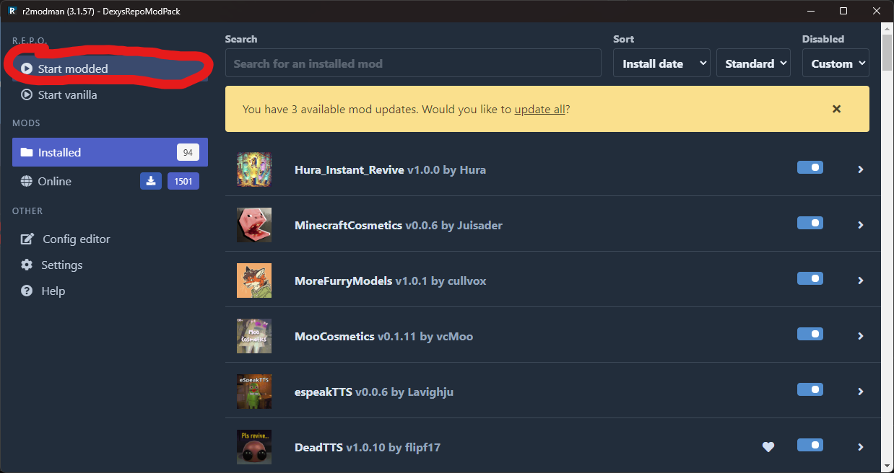

# R2ModMan Installation Guide
by dexy woof

Follow these steps to install and set up R2ModMan for playing modded games:

## Installation Steps

1. **Install R2ModMan From this link:**
   [R2ModMan v3.1.57](https://github.com/ebkr/r2modmanPlus/releases/download/v3.1.57/r2modman-Setup-3.1.57.exe)

2. **Start R2ModMan and Search "Repo" in the Game Selection Screen and click on "Set as default"**


3. **In the Profile Selection Screen, click on "Import/Update" Button.**


4. **Then Click on "From code"**


5. **Type the code and click on "Continue"**
   ```
   01961205-3a8b-0d46-0ea4-694af68a5bda
   ```


6. **Click on "Import".**


7. **After that, click on "Import new profile", or if updating the modpack on "Update existing profile".**


6. **Click on "Create"**


7. **When the download finished, click on the new profile and click on "Select Profile".**


8. **Finally click on "Start modded", to play the modpack!**



## Ready to Play!

Now you've synced your mods! You can start modded and play with friends now!


---
*Note: Make sure you have the base game installed before running the modded version.*
